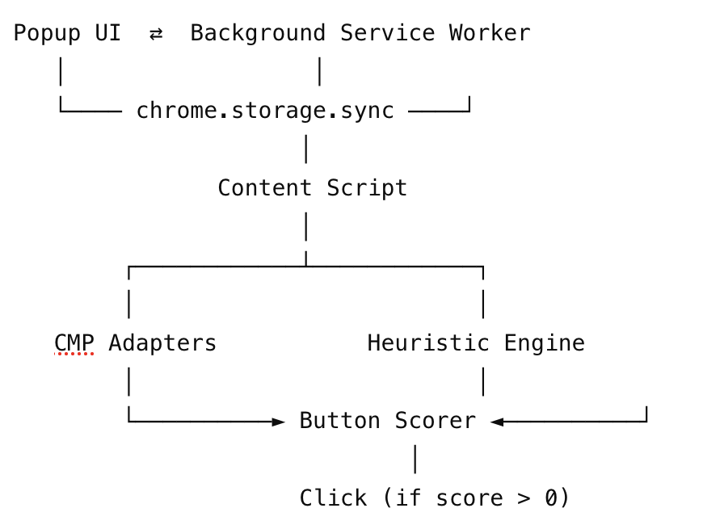

# Crumb Crusher 🍪

> A Chrome extension that automatically rejects cookie consent banners — or selects the least permissive option when rejection isn't available.


## ✨ Features
- **Auto-reject first** — Clicks “Reject all”, “Decline”, “No thanks”, “Opt out”
- **Least-permissions fallback** — Chooses “Necessary only” / “Essential cookies” when reject is unavailable
- **Never accepts** — “Accept all”, “Agree”, “OK” are explicitly ignored (score: `-999`)
- **CMP adapter layer** — Fast-path support for 14+ major Consent Management Platforms:
  - OneTrust, Cookiebot, Didomi, Osano, Complianz, Iubenda, CookieYes, Termly, TrustArc, and more
- **Heuristic fallback engine** — Works on custom/unknown banners using DOM + scoring
- **SPA & lazy-load support** — Handles banners injected after page load via `MutationObserver`
- **Global on/off toggle**
- **Per-site blocklist**
- **Badge counters** — Per-tab and lifetime totals
- **Privacy-first** — No network requests, no analytics, no telemetry


## 🧠 How It Works
### Detection Strategy (in order)

#### 1. CMP Adapters (fast path)
Directly targets known platforms using hardcoded selectors like:
- `#onetrust-reject-all-handler`
- `#CybotCookiebotDialogBodyButtonDecline`

If matched → immediate click (no scoring needed)

#### 2. Heuristic Engine (fallback)

If no CMP is detected:
**Step 1 — Find banner containers**
- Known selectors (`id`, `class`, ARIA roles, data attributes)
- Fallback scan:
  - `position: fixed | sticky` OR `z-index > 100`
  - Text contains: `cookie`, `consent`, `privacy`, `gdpr`

**Step 2 — Score buttons inside container**
| Score | Meaning | Examples |
|------|--------|----------|
| 100 | Reject | Reject all, Decline, No thanks, Opt out |
| 80 | Minimal | Necessary only, Essential cookies |
| 40 | Manage | Manage preferences, Customize |
| 20 | Save | Save settings, Confirm |
| 0 | Unknown | Unrecognized |
| -999 | Accept | Accept all, Agree, OK (**never clicked**) |

👉 Only buttons with `score > 0` are clicked

#### 3. Fallback Behavior
- If only “Accept” options exist → **do nothing**
- If “Manage preferences” is best → open settings (manual completion may be required)


## 🔄 Runtime Behavior
- Runs at `document_idle`
- Immediate detection attempt
- Retries every ~800ms (max 5 attempts)
- `MutationObserver` watches for late-loaded banners (auto-disconnects after ~15s)


## 🏗 Architecture


### Component Responsibilities

| Component | Responsibility |
|----------|---------------|
| `content.js` | Detection + interaction logic (runs per tab) |
| `background.js` | Badge counters, tab lifecycle |
| `popup.js/html` | UI controls + stats |
| `chrome.storage.sync` | Shared state |


## 📦 Storage Schema
```js
{
  enabled: true,
  blocklist: ["example.com"],
  totalHandled: 42
}
```


## 📡 Message Protocol
```js
{ type: "COOKIE_HANDLED", url: string }
```


## ⚙️ Click Mechanism

To maximize compatibility with different CMPs:
```js
el.dispatchEvent(new MouseEvent("click", { bubbles: true, cancelable: true }))
el.dispatchEvent(new PointerEvent("pointerdown", { bubbles: true }))
el.dispatchEvent(new PointerEvent("pointerup", { bubbles: true }))
el.click()
```


## 📁 File Structure
```
crumb-crusher/
├── manifest.json         # MV3 extension manifest — permissions, entry points
├── content.js            # Core detection & interaction logic (injected into every page)
├── background.js         # Service worker — badge management, tab lifecycle
├── popup.html            # Popup UI markup and styles
├── popup.js              # Popup logic — toggle, blocklist, counter display
├── generate-icons.js     # Dev utility to generate placeholder PNG icons
├── icons/
│   ├── icon16.png
│   ├── icon48.png
│   └── icon128.png
├── README.md
└── images/
    └── demo.png
```


## 🚀 Installation (Dev)
### Load as unpacked extension (local dev)
 
1. Download or clone this repository
2. Add icons (choose one):
   - **Option A** — Run the icon generator: `npm install canvas && node generate-icons.js`
   - **Option B** — Drop your own `icon16.png`, `icon48.png`, `icon128.png` into `icons/`
3. Open Chrome and navigate to `chrome://extensions`
4. Enable **Developer mode** using the toggle in the top-right corner
5. Click **Load unpacked**
6. Select the `crumb-crusher/` folder
7. The extension icon appears in your toolbar — you're done
 
### Verify it's working
 
Open any site with a cookie banner (e.g. a major EU news site), open DevTools → Console, and filter by `[Crumb Crusher]`. You should see log output like:
 
```
[Crumb Crusher] Clicking "Reject all" — reason: CMP adapter: #onetrust-reject-all-handler
```


## 🧪 Example Behavior
- Known CMP → instant reject via adapter
- Custom banner → heuristic picks “Necessary only”
- Accept-only site → extension does nothing (safe default)
- SPA → banner handled after dynamic load


## ⚠️ Known Limitations
- ❌ Cross-origin iframes (cannot be accessed)
- ⚠️ “Manage preferences” flows are not auto-configured
- ⚠️ Multi-step consent flows not fully handled
- ⚠️ Some sites detect automated clicks (rare)
- ⚠️ English-only text matching (limited multilingual support)


## 🔧 Scope for Improvement
### Correctness
- Cross-origin iframe strategies (all_frames + messaging)
- Auto-configure “Manage preferences” toggles
- Multi-step consent flow handling
- Multilingual support (FR, DE, ES, IT, NL)

### Reliability
- Human-like click simulation (pointer movement, delays)
- Auto-updating CMP selector registry
- Shadow DOM traversal

### Performance
- DOM scan optimization (time budgeting, requestIdleCallback)
- MutationObserver debouncing

### UX
- Stats dashboard (per-domain insights)
- Indicator when no safe option exists
- Custom rule editor (per-site overrides)
- Blocklist import/export


## 🔒 Privacy
- No network requests
- No tracking or analytics
- No external dependencies
- Stores only:
  - enabled
  - blocklist
  - totalHandled


## 🧩 Summary

This extension uses a two-stage strategy:
- Precision (CMP adapters) — fast, deterministic
- Coverage (heuristics + scoring) — flexible fallback

It is designed to prefer doing nothing over making the wrong choice, ensuring user privacy is never accidentally compromised.
